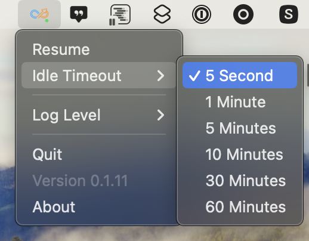
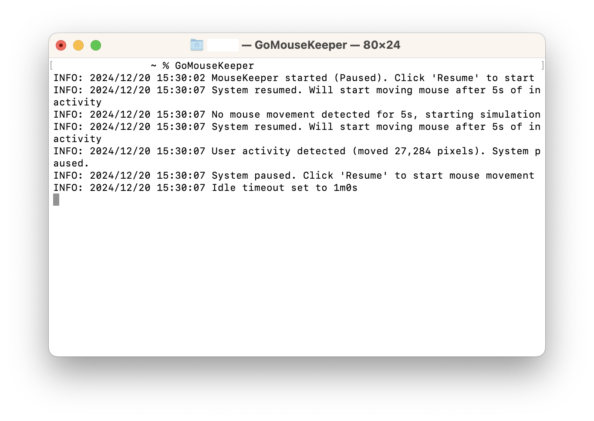

# GoMouseKeeper



GoMouseKeeper / GoMouseBusyer keeps your mouse busy. It's particularly useful in scenarios where you need to maintain screen activity, such as preventing automatic screen locks or maintaining online status.

## Features

- **Random Mouse Movement**: Simulates random mouse movements after a specified idle time
- **User Intervention Detection**: Automatically pauses when manual mouse movement is detected
- **Flexible Timeout Settings**: Multiple timeout options available (5 seconds, 1 minute, 5 minutes, 10 minutes, 30 minutes, 60 minutes)
- **System Tray Integration**: Easy program control through system tray icon

## Installation

### Option 1: Direct Installation (Recommended)

```bash
go install github.com/Hootrix/GoMouseKeeper/cmd/gomousekeeper@latest
```

After installation, simply run `gomousekeeper` in your terminal to start the program.

### Option 2: Install from Source

```bash
git clone https://github.com/Hootrix/GoMouseKeeper.git
cd GoMouseKeeper
go install ./cmd/gomousekeeper
```

## Usage

```bash
$ gomousekeeper
```




1. After running the program, you'll see an icon in your system tray
2. Click the icon to see the following options:
   - Resume/Pause: Start/Stop mouse movement
   - Check Timeout Settings: Set mouse idle time
   - Quit: Exit the program
3. The program starts in paused state by default, click "Resume" to start
4. The program automatically pauses when manual mouse movement is detected

## Status Icon Guide

- `...` (●): Program is running
- `   ` (○): Program is paused

## Contributing

Issues and Pull Requests are welcome!
